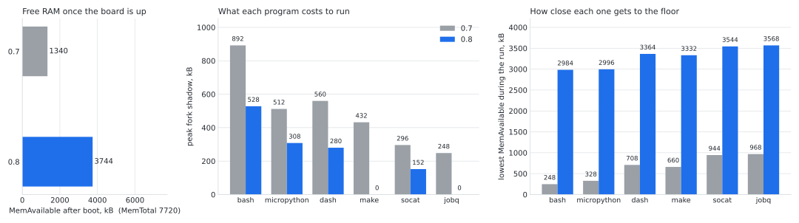

# Linux on an ESP32-S3 — native Linux that stays up

Linux 6.11 running **natively on the ESP32-S3's Xtensa cores**, with WiFi,
Bash, MicroPython and writable storage. Linux is not emulated: Espressif's
firmware runs alongside it on the same chip and handles WiFi and flash access.
All of this runs on one N16R8 board, without extra RAM, an SD card or a second
computer attached to keep it running.

## What's new in 0.8

0.8 is the release where the board stops crashing. Since 0.7 about one factory
boot in ten took a kernel fault in its first seconds, and nobody knew, because
the test counted silence as a pass. The cause was in the firmware: the ESP32-S3
has one flash cache for both cores, and after every write Linux made to jffs2
nothing invalidated it, so the kernel went on reading stale pages, sometimes
of its own code. Four lines in the firmware fix it. Fifty-five factory boots in
a row came up clean on the fixed firmware, measured by a runner that reads
`dmesg` back instead of trusting a quiet console. That does not prove the
board never crashes; it shows the early-boot corruption that used to appear
in one boot of ten is no longer reproducible.

With that gone, the fork backend's page-set exchange, which had been written
off for corrupting memory, turns out never to have: it ships now, and every
program that forks needs half the memory it did. `make` and `jobq` need none,
because they spawn instead. MemAvailable after boot went from 1.3 MB to 3.7 MB.

Smaller things a person notices: `wifi connect` writes its configuration for
the first time, `bootlog verbose` turns the console back up without a rebuild,
an update no longer takes the WiFi password with it, the clock survives a
reboot, and the four dropbear host keys that every board used to share are no
longer in the image. The changelog has the rest, with the numbers.

**Fork is not a full MMU.** This remains NOMMU Linux, with no hardware process
memory protection. The switchable MMU-remap experiment is a separate runtime,
not a loader for arbitrary desktop binaries. See [limits](#limits) below.

## RAM, before and after

Both columns were read off the board through `/proc/meminfo` and
`programbench`: the 0.7 kernel in
[one record](build/verification/2026-09-12-full-image.md), the 0.8 image in
[another](build/verification/2026-09-14-final-image.md).
`build/plot-ram.py` draws the picture from them.

<picture>
  <source media="(prefers-color-scheme: dark)" srcset="docs/ram-before-after-dark.svg">
  
</picture>

The middle panel is what a program costs the fork backend beyond its own
memory: the shadow pages that keep parent and child apart. The exchange
halves it, and `make` and `jobq` spawn instead of forking, so they cost
nothing. The right panel is the floor, the lowest MemAvailable sampled while
each benchmark ran. On 0.7 bash got down to 248 kB, which is where
`fork: Cannot allocate memory` used to come from.

The middle panel again, drawn by GitHub from the numbers in this file, so
they can be checked against the records without opening the picture:

```mermaid
---
config:
  themeVariables:
    xyChart:
      plotColorPalette: "#9aa0a6, #1f6feb"
---
xychart-beta
    title "Peak fork shadow per program, kB (0.7 behind, 0.8 in front)"
    x-axis [bash, micropython, dash, make, socat, jobq]
    y-axis "kB" 0 --> 1000
    bar [892, 512, 560, 432, 296, 248]
    bar [528, 308, 280, 0, 152, 0]
```



## Hardware

- **ESP32-S3 with 16 MB flash and 8 MB Octal PSRAM**: an N16R8 module such as
  the corresponding DevKitC-1.
- Power and a serial/COM connection for flashing and the console. Use your
  board's actual adapter port; no additional peripherals are required.

## Get the current version

`images/` holds the 0.8 release, so the quickest path is to flash what is
already in the repository:

```sh
./flash.sh -p /dev/ttyUSB0
```

That writes the whole 16 MiB chip and replaces `/etc` and `/home`. To build the
same image from source instead, read on.

### The scripted way

`./run.sh` drives the whole path and is the shortest route. With no arguments
it opens a menu; each step is also a flag, so it works unattended:

```sh
git clone https://github.com/paulneja/Linux-on-esp32-S3.git
cd Linux-on-esp32-S3
./run.sh                 # menu
./run.sh --all -y        # check, build, verify, flash and test, no prompts
```

The build prints as it happens rather than sitting silent, and says up front
that it takes roughly 40 minutes and about 21 GB; `-q` sends that output to
the log only. It checks the environment before spending an hour on a build,
finds an interpreter that actually has pyserial, picks an unused output
directory,
warns before anything that erases the board, and offers to close a console
holding the serial port. `./run.sh --help` lists every action, including
`--repro` for a two-build comparison and `--recover` to put a board back to
its factory `/etc` and `/home`.

The rest of this section is the same path by hand.

### 1. Build from a clean checkout

On a Linux host with Git and Docker access, as a regular user:

```sh
git clone https://github.com/paulneja/Linux-on-esp32-S3.git
cd Linux-on-esp32-S3
JOBS=8 bash build/reproduce.sh
```

Allow time for downloads and compilation, and substantial free disk space.
The build uses its own directory and does not reuse the development machine's
toolchain or overwrite the older committed images.

The output is `build-output/reproduce.XXXXXX/artifacts/`, containing the
16 MiB `linux-esp32s3-native-full.bin`, its component images,
`SHA256SUMS` and `build-manifest.json`. Replace `XXXXXX` with the directory
printed by your run. See the [complete build instructions](build/README.md).

### 2. Flash the image you just built

Install esptool on the host, close any console holding the COM port, and use
the actual adapter path in place of `/dev/ttyUSB0`.

**A full-image write replaces configuration and user files, including
`/etc` and `/home`, even without a separate erase command. Back up anything
you need first.**

```sh
./flash.sh -p /dev/ttyUSB0 --images build-output/reproduce.XXXXXX/artifacts
```

`flash.sh` checks every input, its size and the partition layout before it
touches the board. Without `--images` it reads the committed `images/`, so
pass the directory your build produced when you want that one instead. The
equivalent by hand:

```sh
esptool --chip esp32s3 --port /dev/ttyUSB0 --baud 460800 \
    write_flash --flash_mode dio --flash_size 16MB --flash_freq 80m \
    0x0 build-output/reproduce.XXXXXX/artifacts/linux-esp32s3-native-full.bin
```

### 3. Log in and connect

Open your serial terminal at **115200 baud**, using the same COM adapter.
For example:

```sh
screen /dev/ttyUSB0 115200
```

Log in as **`root` / `changeme123`**, then run `passwd` to change the
password. A factory image has no WiFi configured:

```sh
wifi
```

The interactive menu scans and lets you choose a network. Alternatively,
use `wifi connect "YOUR SSID" "YOUR PASSWORD"`.

`Starting network (background): OK` only means startup was launched, not
that WiFi connected. Check `/var/log/network.log` for the result. NTP sets
the clock after networking comes up; until then, HTTPS certificate checks
can fail because the board has no battery-backed clock.

Telnet is enabled by default and sends credentials in clear text. Use a
trusted LAN and read [SECURITY.md](SECURITY.md) before connecting.

## Things to try

- Run a script with `micropython /home/root/script.py`. This is MicroPython,
  not CPython; general `pip` compatibility is not provided.
- Edit `/home/www/index.html`, run `web-server on`, then open the board's IP
  in a browser. `web-server off` disables it; the setting survives reboot.
- Use `crontab -e` to schedule jobs for your user.
- Run `session work` to create or reattach a lightweight shell. Detach with
  **Ctrl-]** and list sessions with `session list`.
- Use `nohup command > /tmp/job.log 2>&1 &` for a noninteractive job that
  should survive closing the console. It does not survive a reboot or power
  loss; make sure closing the terminal does not reset the board.

More commands, measurements and examples are in the
[userspace guide](experiments/mmu-poc/programs/USERSPACE-UPGRADE.md).

## Features carried forward from 0.7

Native `fork()` through software memory banks; Bash 5.2 as the login shell,
BusyBox as `/bin/sh`, Dash available; GNU Make, MicroPython with fork and IPC,
socat and `nc`; an editable web page in `/home/www` and private homes with
Unix permissions; per-user cron, `session`/dtach consoles and `nohup`; `jobq`
and `programbench` for working within 8 MiB; a clean-build pipeline with
checksums, partition checks and a board suite tied to one exact image.

## Features carried forward from 0.6

- **STA WiFi and BLE provisioning.** Join an existing network over the
  console or through the `Esp32-Linux` BLE service. See [BLE.md](BLE.md).
  SoftAP was removed; the board does not host a WiFi access point.
- **nano and Lua.** `vi` points to nano rather than the disabled BusyBox vi
  applet.
- **Hardware RSA acceleration.** The `rsa-esp32s3` Linux Crypto API driver
  has boot-time 512-bit and 2048-bit self-tests.
- **Optional SSH and HTTP services.** Dropbear is controlled with
  `ssh-server on|off|status`; HTTP with `web-server on|off|status`. Copy
  files with `scp -O`: dropbear has no SFTP server, and OpenSSH 9 uses SFTP
  unless told otherwise.
  Both are off by default. SSH is slow on this hardware; the RSA driver does
  not accelerate its Curve25519 operations.
- **NTP and curl.** Plain HTTP works. HTTPS uses certificate verification
  with a trimmed CA bundle and TLS 1.2, but remains experimental under the
  board's RAM constraints.

## Build and test status

What was tested, and on which bytes, is written down rather than implied:

- **The 0.8 board suite ran on a clean build of `8ea9011`** (`7b4c94e` in
  this history): a fresh clone, `run.sh --all`, **36 tests, 0 failed**; then
  ten checks beyond the suite (10/10), ten factory boots with `dmesg` and the
  taint flags read back (10 clean), and the board driven from another machine
  over WiFi (SSH, scp, the web page).
  [`2026-09-14-final-image.md`](build/verification/2026-09-14-final-image.md).
- **The published image was built by the Image workflow from `13c85d6`**,
  the tagged sources. Between `8ea9011` and that commit the build inputs
  changed only in comments, plus the `wifi connect` fix, and the rootfs in
  `images/` carries that fix (the script in it is byte-identical to the one
  in the tree). Two independent container builds of the commit differ in one
  file, `/etc/shadow`, from the random password salt.
  [`2026-09-14-release.md`](build/verification/2026-09-14-release.md).
- **Not done yet:** the exact bytes in `images/` have not been through the
  board suite themselves. That run is the next record.
- **The corruption fix, measured:** 55 factory boots in a row on the fixed
  firmware, all clean, against 10 faults in 17 before it.
  [`2026-09-14-cache-fix.md`](build/verification/2026-09-14-cache-fix.md).

A build succeeding is not the same as a board test passing. Every image
carries a `build-manifest.json`, and every board run a `results.json` that
names the image hash it ran on. The board suite does not test sustained
flash reclaim.

## Limits

- **8 MiB RAM is a real constraint.** Fork eagerly copies private memory;
  it is not copy-on-write. The backend is UP-only, rejects multithreaded fork
  and limits private memory per fork to 512 KiB. Several Bash sessions or
  large pipelines can run out of memory; detached sessions default to Dash.
- **A context switch can hold interrupts off for about 21 ms.** The backend
  moves a process's private memory on every switch, up to the 512 KiB
  ceiling, with interrupts disabled; over the full ceiling that is 21.5 ms,
  longer than the 10 ms tick. Copy-on-write would avoid it and is not possible
  on this chip: an unpermitted write fails and raises an asynchronous
  interrupt, so there is no restartable fault to copy a page and retry the
  store from. `/proc/meminfo` reports `ForkSwitchMax` and `ForkSwitchLast`.
- **Native binaries must target Xtensa/FDPIC.** Arbitrary x86, ARM or desktop
  Linux binaries do not run. CPython, Neovim, SQLite, sudo and doas are not
  included.
- **Writable flash can become extremely slow.** `/etc` and `/home` use
  JFFS2. Large writes and block reclaim caused severe slowdowns in tests,
  including with fork disabled and with the 0.6 kernel. Startup changes
  mitigate the boot impact; they do not fix write throughput. Avoid heavy
  rewrites and keep important data backed up. This has been there since
  earlier versions and only turned up under heavy stress testing; the cause is
  still open and I intend to fix it later. See the
  [flash-write investigation](build/verification/2026-09-06-jffs2-erase.md).
- **Permissions are not memory isolation.** Use trusted programs and users.
  This is a research project, not a hardened production system.
- **The rootfs is read-only XIP cramfs.** Executing directly from flash is
  essential to fitting the system in RAM. Build through the full pipeline;
  matching extracted files alone does not validate a manually repacked image.

## Flashing the committed images

```sh
./flash.sh -p /dev/ttyUSB0
```

The script reads `images/` unless `--images` points elsewhere, and requires
Python 3 and esptool. Everything in `images/` belongs to the 0.8 release and
matches the combined image there byte for byte. Earlier releases and their
binaries stay on the releases page.

- Default full-image flashing replaces both `/etc` and `/home`.
- `--parts` preserves `/home`, but replaces `/etc`, including accounts and
  network configuration.
- `--parts --erase` wipes the chip; it writes a factory `home.jffs2` when the
  image directory has one, and otherwise leaves `/home` erased, which the
  board formats on its first write.

`make-images.sh` and the existing GitHub Actions workflow are the older
base-system build path, not the complete fork-enabled pipeline.

## Documentation

- [Build pipeline](build/README.md): clean builds, artifacts and board tests.
- [Architecture](ARCHITECTURE.md): shared chip, boot flow and flash layout.
- [Development](DEVELOPMENT.md): patches, upstream sources and the legacy build.
- [Userspace](experiments/mmu-poc/programs/USERSPACE-UPGRADE.md): programs,
  fork implementation and measured limits.
- [Troubleshooting](TROUBLESHOOTING.md), [security](SECURITY.md),
  [Bluetooth setup](BLE.md) and [changelog](CHANGELOG.md).
- The long version of 0.8: the flash-cache corruption is
  [incident 15 in DEVELOPMENT.md](DEVELOPMENT.md), the page-set exchange
  incident 16, the numbers are in the [changelog](CHANGELOG.md), and the raw
  evidence -- hashes, `dmesg`, per-test results -- is under
  [`build/verification/`](build/verification/).

## History, credits and license

The original 0.1 approach emulated a RISC-V machine. The current project runs
native Xtensa Linux; the older approach remains in Git history.

Built on the Xtensa Linux, Buildroot and esp-hosted work of
[**jcmvbkbc**](https://github.com/jcmvbkbc) (Max Filippov), and on Espressif's
firmware. See [NOTICE](NOTICE) for third-party components and licenses.

This project is licensed under the **GPLv3** (see [LICENSE](LICENSE)). Kernel
code contributed here (`drivers/crypto/esp32s3_rsa.c`) is GPL-2.0-or-later.

P.S: Sorry for the wait 🥲
